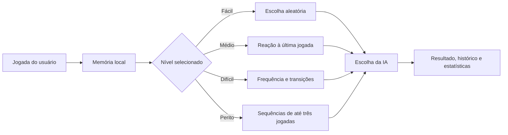

<div align="center">

# Jokenpo Pro

### Pedra, Papel, Tesoura, Lagarto e Spock com inteligência adaptativa

[](https://paulo968.github.io/JokenpoPro/)


</div>

## Sobre o projeto

O Jokenpo Pro expande o jogo clássico com cinco opções de jogada, quatro níveis de inteligência, modos de série, estatísticas e instalação como aplicativo.

A versão atual foi reconstruída para funcionar de forma consistente em computadores, tablets e celulares. O documento principal não cria rolagem horizontal ou vertical fantasma; quando uma tela pequena não comporta todo o conteúdo, apenas a área interna necessária recebe rolagem controlada.

## Principais funcionalidades

- Pedra, Papel, Tesoura, Lagarto e Spock;
- jogo livre, melhor de 3 e melhor de 5;
- quatro níveis de dificuldade;
- IA adaptativa com frequência, transições e sequências;
- placar e histórico persistidos no navegador;
- estatísticas filtradas por dificuldade;
- análise de jogada favorita, eficiência e nêmesis;
- temas claro e escuro;
- sons, vibração e animações sem bibliotecas externas;
- atalhos numéricos de `1` a `5`;
- interface acessível por teclado e leitores de tela;
- manifest e Service Worker para instalação e uso offline.

## Como a inteligência evolui



## Níveis de dificuldade

| Nível | Estratégia |
|---|---|
| Fácil | Escolhas aleatórias |
| Médio | Reage à última jogada, mas ainda comete erros |
| Difícil | Analisa frequência e transições entre jogadas |
| Perito | Procura sequências de até três movimentos e combina modelos de previsão |

## Responsividade

O layout foi validado nos seguintes tamanhos de tela:

- `1920 × 1080`;
- `1366 × 768`;
- `1024 × 768`;
- `844 × 390` em orientação horizontal;
- `375 × 667`;
- `320 × 568`.

A página mantém `html` e `body` presos à área visível para evitar scroll fantasma. Em telas menores, menu, jogo, histórico e modais usam rolagem interna apenas quando necessário.

## Arquitetura

```text
JokenpoPro/
├── index.html              # Entrada pública e redirecionamento compatível
├── game.html               # Estrutura semântica da aplicação
├── styles.css              # Layout, temas e responsividade
├── app.js                  # Estado, interface e fluxo das partidas
├── core.js                 # Regras, migração de dados e motor da IA
├── effects.js              # Sons, vibração e confetes
├── manifest.webmanifest    # Instalação como PWA
├── sw.js                   # Cache e funcionamento offline
├── icon.svg
├── README.md
└── LICENSE
```

A separação reduz o antigo arquivo único e facilita manutenção, testes e evolução.

## Tecnologias

`HTML5` · `CSS3` · `JavaScript ES6 Modules` · `Web Audio API` · `LocalStorage` · `Service Worker` · `PWA`

O jogo não depende de frameworks ou bibliotecas JavaScript externas para funcionar.

## Executando localmente

```bash
git clone https://github.com/Paulo968/JokenpoPro.git
cd JokenpoPro
python -m http.server 8000
```

Depois acesse `http://localhost:8000`.

O servidor local é necessário para testar módulos JavaScript, Service Worker e recursos de PWA corretamente.

## Autor

Desenvolvido por [Paulo Zaqueu](https://github.com/Paulo968).

[Portfólio](https://portfolio-paulo-ashy.vercel.app/) · [LinkedIn](https://www.linkedin.com/in/paulo-zaqueu-762459187) · [E-mail](mailto:paulozaqueu3@gmail.com)

## Licença

Distribuído sob a licença MIT. Consulte o arquivo `LICENSE`.
