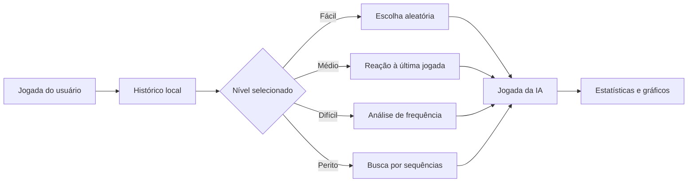

<div align="center">

# Jokenpo Pro

### Pedra, Papel, Tesoura, Lagarto e Spock com inteligência adaptativa

[](https://paulo968.github.io/JokenpoPro/)


</div>

## Sobre o projeto

O Jokenpo Pro expande o jogo clássico com cinco opções de jogada e diferentes níveis de dificuldade. A aplicação observa o comportamento do jogador, identifica padrões simples e ajusta sua estratégia conforme o nível selecionado.

Além da lógica do jogo, o projeto explora experiência de usuário, persistência local, visualização de dados e funcionamento offline.

## Como a inteligência evolui



## Funcionalidades

- Cinco opções de jogada: Pedra, Papel, Tesoura, Lagarto e Spock;
- quatro níveis de dificuldade;
- inteligência adaptativa baseada no histórico recente;
- estatísticas e gráficos com Chart.js;
- histórico de partidas e taxa de vitória;
- efeitos sonoros e animações de vitória;
- temas claro e escuro;
- atalhos de teclado;
- exportação e importação do progresso em JSON;
- suporte a PWA e funcionamento offline.

## Níveis de dificuldade

| Nível | Estratégia |
|---|---|
| Fácil | Escolhas aleatórias |
| Médio | Reage à última jogada do usuário |
| Difícil | Analisa as escolhas mais frequentes |
| Perito | Procura sequências e padrões recorrentes |

## Tecnologias

`HTML5` · `CSS3` · `JavaScript ES6+` · `Chart.js` · `Canvas Confetti` · `Service Worker` · `PWA`

## Estrutura

```text
JokenpoPro/
├── assets/
├── index.html
├── README.md
└── LICENSE
```

## Executando localmente

```bash
git clone https://github.com/Paulo968/JokenpoPro.git
cd JokenpoPro
```

Depois, abra o arquivo `index.html` no navegador. Para testar corretamente os recursos de PWA, utilize um servidor local, como a extensão Live Server do VS Code.

## Autor

Desenvolvido por [Paulo Zaqueu](https://github.com/Paulo968).

[Portfólio](https://portfolio-paulo-ashy.vercel.app/) · [LinkedIn](https://www.linkedin.com/in/paulo-zaqueu-762459187) · [E-mail](mailto:paulozaqueu3@gmail.com)

## Licença

Distribuído sob a licença MIT. Consulte o arquivo `LICENSE`.
